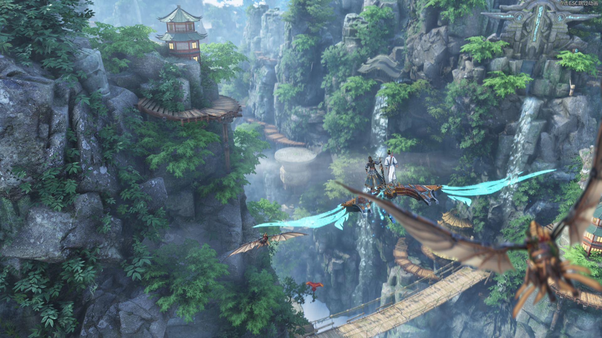

# 《古剑奇谭网络版》 四测四方面建议

## 目录
- [前言](#overview)
- [一，画质美术](#graphics)
- [二，操作感受](#handling)
- [三，系统设计](#design)
- [四，剧情表现](#story)
- [附一，BUG和小问题](#bug)
- [附二，胡说八道](#others)
- [感言](#acknowledgement)

##  前言

时隔将近一年，终于又等到了古网的最新一次测试。说实话，我们已经等得太久了…… 
这一测，可以看到这一年内烛龙投入到古网中的心血，投入到古网中的精力。确实，相比于之前的迷茫，我们可以看到这一测古网终于有了一个完善的框架，无论是剧情表现，或是战斗，还是优化，特别是服务器质量，对于三测的提升都是相当明显的。然而，虽然古网纵向比较已经进步很多，但仅仅是和自己进行纵向比较当然是不够的。相比于同时期的其他作品，古网还是存在着很多需要调整和优化的方面，不可怠慢，还需继续前行。 
这个建议贴，正如标题所说，是从 **画面，操作，系统和剧情** 四个方面所进行的建议。在每个方面中，我们都会按照问题重要与否的优先级的顺序，把我们所认为的该方面的问题从大到小地列出来，并试图给出我们自己的一个修改范例作为参考。以及在正文的最后，我们还有两个小的附录章节，来报告一些bug和小问题，以及大开脑洞胡说八道。 
术业有专攻，我们提出的建议难免显得稚嫩，还望烛龙的staff能举一反三，去繁化简了。

##  一，画质美术

首先要说到的是画质上的问题。诚然，古网这一测在某些方面，例如脸部模型，头发贴图以及服装材质上有了很大的提高。不过实话实说，不知为何，总感觉某些地图的环境光影效果遭到了阉割，特别是在夜景之中整个场景缺少光源，显得略为扁平。另外古网现在感觉不同地图的画质差异也较大，各门派洞天画质相当不错，但是例如长阜苑等地图贴图和质感却十分违和。感觉古网在画面这方面的调整仍是任重道远。下面指出的是一些对观感影响比较大的画质或美术问题，仅供参考。

### 问题1-1：弱光下的场景表现

* **问题叙述在弱光环境下，某些场景的画面表现比较糟糕。** （例如长阜苑，其余的夜晚地图，以及各个洞穴副本内部）具体表现在：整个场景的贴图显得非常没有质感。缺少光源，没有任何高光或其他合理的阴影反馈，整个场景显得十分扁平且没有层次感。甚至有些场景，例如步云州的晚上和长合山天幕台的晚上，前两测夜晚表现还行，这一测整个画质体验却突然下降了。 
感觉古网现在的画面表现，对天气的要求非常高，必须要白天这种光线充足的时候画面的光影质感才比较好，如果后期古网要加上昼夜和天气表现的话，这个问题还是必须要解决的硬问题。不过古网某些弱光场景，例如生死之间，表现又出奇的好，希望其他场景可以多多学习。 
如下图的步云洲，画面光效效果非常尴尬。

而如下图的生死之间，画面表现却还是相当不错的。

### 问题1-2：模糊的岩石贴图

* **问题叙述：某些岩石或山体的贴图太过模糊，远景山体建模的贴图太糊，阴影没有层次感，严重影响游玩感受。** 岩石贴图模糊体现在长阜苑，流花宫或各个副本内部，特别是江流，烬木和石火三个本。这三个本都是由各种岩石，弱光环境组成的，整个副本的画质和野外地图差距太大，对副本游玩观感造成了一定影响。而远景山体模糊的问题具体表现在怀秀村，长合山等地图，远景的山体看着跟一个个硬纸板一样插入其中，过于妨碍视觉体验。如下面两图所示：

同样是山体，下图白天的百草谷却表现不俗，仿佛置身于两个游戏中。

### 问题1-3：御剑的武器设计

* **问题叙述：不知道其他职业如何，但御剑的武器设计实在是有待提高……** 首先是建模种类不多，且只有几个70品以后的武器建模是能看的。这里说的丑，不是指的建模不精细，而是说的设计和配色诡异，杂乱不严谨。举个例子，那个负青天剑的模型感觉是最常用的一个武器模型，然后无论是建模还是配色都相当不给力，甚至没有新手木柄剑好看，真是没有让人换武器的动力啊……古一古二那么多单手剑的建模和设计，古网可否参考一下呢？

##  二，操作感受

古网这一测的战斗相比于三测又是一次大的改变。实话实说，现在的战斗雏形我觉得已经差不多了，烛龙真的不用再一言不合就重做战斗系统了，现在这个框架整体来说要比满测和三测有趣很多，技能循环也合理了很多。不过也许是新的战斗框架和动作刚刚做完的原因，这一测的战斗虽然设计上尚可，但是手感上却有很多不舒服，不方便的地方，让人感觉十分僵硬。大部分玩家是不太理性的，**对于玩家而言，他们在进入游戏后的第一感觉，并不是整个战斗的设计有多好，而是这个战斗的操作和手感如何。** 所以如果古网想在开头就吸引住玩家，吸引住路人的兴趣的话，战斗的手感优化是必不可少的呢。 
因为我这一测主玩的是御剑，所以以下建议基本都是从御剑，以及DPS角度入手的，关于T和奶的反馈比较少，见谅。

### 问题2-1：跳跃和闪避的操作太肉

* **问题叙述：跳跃和闪避等规避伤害的动作不够跟手，有点肉。** 具体来说，体现在跳跃和闪避的动作比较迟滞，在紧张战局中有时点击了跳跃或闪避后，要等短暂的技能后摇结束才触发，有时候因此发生的操作失误会让人很恼火。另外是闪避动作的问题，现在的这个闪避动作是一个类似于侧身平移的动作，也许烛龙觉得这个动作比较有修仙的飘逸感和优雅感，但是实话实说，从前几测开始我就觉得这个平移的闪避动作显得太拖泥带水，太僵硬。
* **建议：优化闪避等规避伤害动作的操作感。** 具体来说，分为三个方面：一，允许跳跃和闪避强行中断当前动作，增强玩家在进战战局中的操作舒适感；二，修改各职业闪避的动作射击，改成翻滚的连续动作，起码视觉上看起来还比较灵巧；三，增加空中的闪避动作，增加角色的机动性，也就是说进战后起跳（也就是非疾跑状态的起跳），空中双击方向键则可往某个方向进行冲刺闪避。

### 问题2-2：关于移动攻击和空中攻击的探讨

* **问题叙述：移动攻击和空中攻击的操作性有待优化。** 首先是移动攻击，这一测远程大部分时候几乎所有技能都是不允许移动释放的，无论是平A读条还是蓄力（应该是为了职业平衡？）。而近战虽然有一些技能能移动释放，但是移动速度非常缓慢，不能很好地起到规避伤害的作用。实话实话，不能移动攻击还是非常影响手感的，这是路人玩家对于古网的第一观感。另外古网这一测由于重新做了动作，很多职业的空中攻击动作十分僵硬，直接用的地面的攻击动作，显得十分违和，这个肯定是要调优的。另外一个是古网现在一旦滞空攻击，整个角色就会完全停留在空中，根本不会下坠，我觉得这就太僵硬了些。总而言之，手感上的调整迫在眉睫，做好这个起码可以留住第一波挑剔的玩家。
* **建议：首先是移动攻击，建议近战提高移动攻击时的移动速度，和增加可移动攻击的技能种类。** 近战相比于远程，确实需要更多规避伤害方式，现在近战平A移动虽可但是太慢，其他技能移动攻击的种类太少，略微鸡肋，还望提速。**远程的话，希望对于某些低伤害技能允许以合理的速度走A，例如御剑的qe技能。** 这些技能不是主力输出技能，允许走A不会太多的影响平衡，这个设定主要是为了提升手感，这也是在游戏前期留住玩家的一个trick吧。**对于各职业的滞空攻击的话，希望回到三测的模式，在空中攻击也会慢速逐渐下落（类似DMC，Bayonetta等ACT的感觉），** 现在这样停在空中过于简单粗暴，给人一种卡顿和僵硬感。

### 问题2-3：怪物的受击反馈仍需提高

* **问题叙述：和大岭之前也反馈过，古网现在的怪物受击反馈需要调整。** 一来是，虽然古网现在有一部分怪物确实受击反馈动作已经加上了，但是对于某些小怪例如渭川源的黄鼠狼，因为他们的大部分技能都是蓄力或读条技能，而古网设定当小怪进入蓄力或读条的时候，除非被打断否则一直是霸体状态，这就造成了他们基本上一直处在一个霸体状态，受打击反馈就算加上了也体现不出来。二来是，不知道是不是我的错觉，总感觉有些怪物就算不是在霸体状态受击反馈也不太明显，是因为还没有做完的原因吗？
* **建议：需要尽快调优，起码把低等级小怪的受击反馈体验要弄好。** 首先可以减少低等级怪物蓄力或者霸体的时间比重，起码让玩家刚进入游戏的时候可以收获一个优秀的打击体验，抓住玩家的兴趣点。其次是好好做做每种怪物的受击动作，起码在公测版本中对于每个怪物都能让玩家有舒适的打击感。

### 问题2-4：技能提示效果不明显

* **问题叙述：职业技能提示效果和BUFF太不明显，在战斗中要观察到太不容易，用户体验不佳。** 拿御剑为例，羽鹤遥的层数在下方仅仅用一个小小的数字进行显示，用眼镜的余光太难看清。御剑的剑意图标太小且不明显，有时候画面乱起来要看清也不容易，BUFF和DEBUFF效果也太小且不明显，不便于观察。伤害数字也太小，暴击伤害和普通伤害也仅仅是颜色上的区别。
* **建议：优化技能提示显示效果。** 例如御剑的剑意图标可以改的大一点显眼一些；羽鹤遥充能层数可以显示在更显眼的地方；伤害数字略微增大，以及对于暴击伤害采用另外一种字体进行区分。

### 问题2-5：远程无锁定的问题

* **问题叙述：远程就算是无锁定，也是需要准星的。** 说实话，在游戏中，总感觉远程的无锁定只是一个噱头，于体验却没有什么实际的提升。在战斗过程中，常常不知道中心点在哪，以及同时很难看清怪物的buff状态，以及相对位置之类的。
* **建议：还是建议远程变为智能锁定，起码加个锁定提示框，** 告诉玩家方便现在这个怪物是不是进入攻击范围内了。以及一些蓄力读条AOE技能，例如御剑的繁霜落等可以显示出攻击范围，方便玩家做判断。

### 问题2-6：神虹决的万剑朝元问题

* **问题叙述：御剑神虹决的“万剑朝元”显示效果不容易观察。** 一来，神虹决本身的定位就是偏单体的输出，面对的对象大部分也是单体的boss或怪物。就算是在群怪AOE的时候，玩家也没心思去看那一群怪是不是都被标记了万剑朝宗标记；二来，标记到怪物头顶的话，玩家想观察到万剑朝元实在是太不容易，太不显眼了，累眼睛；三来，多个御剑的万剑朝元标记会造成重复，在BOSS战中无法区分。
* **建议：首先，建议将万剑朝元改成玩家的单人buff而不是对某个特定怪物的标记。** 这样的话，玩家就很容易知道自己是否处于万剑朝元状态，来保证玩家操作的舒适度（其余的数值平衡可以随着修改）。

### 问题2-7：神虹决背后的剑

* **问题叙述：神虹决真的背后的剑一动不动……** 然后释放技能的时候，技能出现的剑气建模还是一把固定的橙武的建模。
* **建议：神虹决的武器也需要和角色有一点互动吧，要不然真的成背部挂件了。** 起码神虹决的剑气技能特效应该是当前武器的建模，以及技能释放时武器也稍微出鞘意思意思。

##  三，系统设计

如果你们要问我对于这一测古网最深刻的印象是什么，**那我一定会回答是：肝**（想必一定有很多人也抱怨过类似的问题了2333）。古网这一测确实存在着很多游玩节奏上的问题。实话实说，用我的一个团友的话说，就是我们相信烛龙的策划也是有自己的考虑的，毕竟烛龙也是需要赚钱，需要养家糊口的。不过我们作为玩家的角度，确实是感觉难以支撑……所以我们在这里放上一点对这测系统和节奏的思考与分析，提供给烛龙的staff们作为参考吧。

### 问题3-1：副本和日常声望收益的权衡

* **问题叙述：过多的时间耗费在了枯燥的成长事件中，玩家无法将精力放在体验游戏乐趣上。** 这也是这一测我最不喜欢的地方，就像是去外面吃饭，我是去吃主菜的，结果饭店说不行，你必须要先把开头的凉菜小盘给吃了。我说好好好，那我吃凉菜，结果老板给我上了20盘凉菜。结果我20盘凉菜吃的撑撑的，说老板总得给我来主菜了吧？老板说好咧，然后……就给我上了一盘主菜，对的，就一盘。我TM是来吃主菜的你一天到晚逼我去吃开头的凉菜，主菜也没啥分量。 
在游戏中，我们无法将大部分精力投入到开荒，团本等游戏体验乐趣中，因为除了最高级的困难团本，其他无论是副本还是团本的产出均很难和声望装备相抗衡，何况团本和豪侠副本还有CD。相反地，我们的大部分时间都浪费在无意义的到处跑路赚声望，到处刷小怪赚星蕴和狗粮等无趣又浪费时间的活动上，因为这些枯燥的简单的任务才能给我们带来最实惠的收益。这就造成了我们必须要去吃，去大量地做无趣的事才能给我们自己带来收益，反而去体验游戏乐趣变得没有价值了。体验乐趣和成长乐趣被割裂开来，让人十分烦躁。
* **建议：提升副本团本等的可玩性和收益，弱化日常声望的收益和复杂度。** 具体来说，就是提高副本和团本产出装备和材料的重要性（例如更好的装备），让玩家在费劲心力通关副本之后能得到应有的收益。同时，弱化日常任务声望的重要性，可表现在日常声望仅仅产出最低级的装备，仅仅提供一些强化石，或者很难产出高级装备等。 
我觉得游戏中一个比较合理的PVE平衡原则应该是：**以副本和团本为主要体验乐趣和主要成长项，日常只是辅助。** 做了日常，可以帮助你对现有装备进行更好地强化；但如果你只去打本，不做日常或者日常做的少了，影响也不大，装备也能提升。如果有些玩家不喜欢下本只靠做日常出装备，ok，没问题，也给他们这个选项，但是这么做的话要保证制造高级装备难度加大，**要使得日常产出高级装备的难度远高于副本和团本（因为副本和团本的挑战难度远高于日常，当然收益也应大于日常）。** 
现在古网的情况本末倒置，变成了日常才是主要成长项，副本可做可不做，打通了也没有太大装备上的收益，实在让人提不起兴趣。

### 问题3-2：副本中的小怪太多太杂

* **问题叙述：副本中的小怪太多太杂，严重影响副本体验和时间。** 我认为小怪数量，在精不在多，古网这一测野外小怪单体实力增强了，数量减少，却让主线任务变得有挑战性，不是无脑割草，反而有点意思。但是在副本里，仍是小怪扎堆，这样一来是清一些无意义的小怪清的很累，耗费时间又无聊。以及有些小怪也确实要注意一下，伤害和血量都快赶上一个BOSS了，在豪侠本没有红圈的情况下还喜欢乱跳，比BOSS打着还麻烦……
* **建议：建议仿照野外地图进行精简，留下一些有特色的精英的小怪即可。** 不如多一些有特色的精英怪，玩耍起来还比较有目标，比较有序。要不然杂鱼太多打起来乱七八糟，太过无序和混乱，又浪费时间。保证在副本中玩家的主要精力应该是放在BOSS的挑战上，而不是在小怪和赶路上。

### 问题3-3：照影系统数值的影响性过大

* **问题叙述：照影系统数值的影响性过大。** 整个游戏的系统实在太过冗余了，装备种类也多，装备的玩法也多，星蕴需求也大，就连看起来萌萌的照影系统也是需要大量的时间投入，并对于人物成长的影响也是巨大的。玩家面对这么多的系统，什么都想做，什么都不能缺，只能让人越来越累。
* **建议：建议改成娱乐向，生活技能向的产物。** 我还是建议大家削弱甚至去掉照影对于人物数值成长的影响，而转而变成一个更为生活技能项的产物。举个例子，照影不再分为四个成长方向，只有一个综合的等级，其加成的属性随着我们的专精而决定（例如DPS专精下就是攻，防御专精下就是御等），这样一来减少照影对于人物属性的影响；以及照影的技能可以偏向生活技能类，例如增加钓鱼速度，增加采集效率，增加强化石和装备掉率，增加药品持续时间等等等等。 
这里的意思，还是希望可以把照影改成一个比较软的辅助类，娱乐类系统。毕竟古网现在有的，和成长相关的硬核心系统已经够多了（装备，残卷，星蕴），就不要让玩家那么累，再去肝照影了。

### 问题3-4：日常任务类型太杂且重复

* **问题叙述：古网现在的日常任务，涉及面太广太杂。** 举个例子，我们一天要做的事多少：首先，挖宝；其次，两个日常本；再来，满世界的采集；最后，满世界的区域任务赚取声望。特别是最后两个任务，我们基本上要跑遍所有的地图。
* **建议：让每天的日常专一点，最好集中在一两个地图就好，任务种类也专一点，例如周一专门是挖宝，周二专门是钓鱼之类的。** 任务多少无所谓，只要不让人们每天重复做同样的事，不要让人们容易感到厌倦。说穿了，就是不要让玩家每天都全世界地跑，古网地图本就不大，这样还每天强制人们跑图，无聊不说，还容易让人们丧失对于地图的新鲜感。

### 问题3-5：装备数目过多

* **问题叙述：古网现在的装备数目过多。** 防具 + 饰品 + 信物达到了15件，加上武器甚至达到了16件之多，对每次升级装备都造成了很大的困难。
* **建议：可以精简一下，把3件信物给取消了，留下12件就好。** 如果不想精简的话，**起码让一个职业的不同星蕴定式下有一些装备能共用。** 举个例子，每个职业的两个专精，3个信物都是共用的，加成的只是一些例如专精掌握之类的对于每个专精都有用的属性。这样做的目的是，减少玩家切换定式时的消耗，方便玩家尝试不同定式。要不然按照现在这个样子，玩家切换一个定式就意味着要换16件装备，一般的玩家实在是肝不起肝不起，一般人只能养得起一个专精，双专精也名存实亡。

### 问题3-6：副本组队

* **问题叙述：路人喊组队太累了** ，打一个日常本有时候组队都要组半天，还要在世界频道上不停地喊话和找人，实在太过心累。
* **建议：希望能有一个副本匹配系统。** 例如每日的日常任务，可以直接通过系统匹配后直接进本之类的，免去跑路和地图上喊话的时间。这也是网游中一个常见的系统吧，希望古网可以早日配置上。

##  四，剧情表现

古网一测一测走过来，给我一个很大的感受就是，相比于偏向MMOARPG，古网更想做一个能承载世界观的，传统的MMORPG。而一个MMORPG要想真正做好，其世界观的构建和代入感的演绎自然是十分重要的。 
其实大家都能看到，古网其实在剧情上投入的精力和心血很多，例如繁多的即时演算过场，全剧情配音，以及主线任务流程的设计等等。但是我们就我们看来，古网的剧情表现仍说不上十分上乘，仍需提高。不说别的，就说古剑系列最引以为豪的代入感营造等，古网都并没有做的很好。这其中在我们看来，有剧情文案本身的问题，也有编排上的问题，而且说真的，**我们觉得问题还是挺大的……** 在此我们试着抛砖引玉，给烛龙的staff们提出一些现有剧情体验过程中的不满。

### 问题4-1：任务搭配缺少代入感

* **问题叙述：整个古网的主线支线任务搭配混乱，整体不严谨，缺少代入感。** 举个例子，在拔仙台剧情处，玩家都要挂了，NPC还乐呵地差使玩家去干杂活……类似的情节屡见不鲜，感觉古网在任务，特别是支线任务上特别不走心，就感觉是为了在这个地点设任务而强行插入的任务，完全没有和当时的主线情境相挂钩，总给人一种敷衍了事的感觉。一旦带入具体情节去看，就会显得特别搞笑。每当我想去代入到角色中的时候，游戏就会狠狠地嘲笑我：别太认真了，我们就是在过家家呢。
* **建议：其次是调整支线和主线的次序，支线任务应该要配合和满足主线任务，不能破坏主线任务的代入感。** 还是拿拔仙台处的剧情举例，玩家都快挂了，去拔仙台的第一件事当然是先去救命啊！！！为什么还有闲情去打杂啊！！！角色自己就不怕自己没命么！！！所以合理的剧情编排应该是： 
首先，玩家在邪剑入体后会有一个debuff，血量上限减少，攻击降低，CD变长等（让玩家感受到自己确实情况不妙了）；然后，进入拔仙台后只有救自己的命这个主线任务（并且这个主线任务环最多只有几步），其他的支线任务完全不显示；接下来，我们被迅速传送到拔仙台顶部，喝上救命药；最后，复原了之后，再让主角去拔仙台的温泉泡澡，这才开放拔仙台的其他主线和支线任务。（等于让玩家在紧张的救命环节之后舒缓下来，才有闲情逸致去打杂）。 
这样的安排，才是一张一弛，符合逻辑。

### 问题4-2：整个剧情缺乏motivation

* **问题叙述：整个剧情的motivation（动机）比较奇怪，我们莫名其妙地就参与了主线的发展。** 我就是一个刚入门的弟子，怎么就钦定去拯救世界了呢？我也实在不是谦虚，和昊苍说：你们还是另请高明把。昊苍说道：秦陵之盟已经研究决定啦，就由你来当玉面蛟龙！……说正经的，感觉整个剧情的开头比较奇怪，我只是一个小小的弟子，遇到了这么大的事情，为啥你们碰到啥事都要叫我同行帮忙呢？话说就我这个刚入门3个月的菜鸟，你们不觉得我去或不去根本就没影响吗？我们所操作的角色全程都在被推着走，感觉自己是可有可无的，一直没有一个强烈的motivation。 
**整个剧情从头到尾，都没人问过主角，他想不想继续搜查下去。** 我就是个无关的路人，突然就被拉来帮你们忙了……这件事还挺危险的，动不动就邪气入体要丧命，我就想好好呆在门派洞天打酱油不行么…… 
* **建议：希望开头处可以有一些矛盾和冲突，让玩家不仅仅是被NPC推着走，起码在剧情设定上也是自己想继续追查下去的。** 例如百草谷昊苍叛变后，昊苍将守卫百草谷的主角的一个同门师姐重伤（和问题4-4对应，这个师姐可以在开头的门派新手任务中出现，和主角一起经过入门试炼，增加和主角的羁绊）。然后主角在门派长老们面前立誓一定要追回昊苍，为师姐报仇雪恨之类的。 
当然，这里只是一个比较随意的脑洞。这个脑洞后面体现出来的思想是，**希望我们的主角也能有自己的motivation，来主动地参与主线的发展**，要不然我玩着玩着经常缺乏动力，觉得这些东西你们为啥叫我干？自己想去做，和被别人推着去做，是两件不一样的事。

### 问题4-3：主线缺乏明确脉络

* **问题叙述：整个剧情的主线没有一条明确的脉络，倒是多个独立的情景剧的串联。** 我们整个主线到底是去追查什么东西的，最根本的goal（目标）是什么？你让我现在想想，我还真的有点迷糊了。感觉有时候又是邪剑，有时候又是陌胜剑，有时候又是仪商剑；有时候又是魅珈，有时候又是昊苍，有时候又是荒人，有时候又是惊蛰教，有时候又突然跑去救小白龙，有时候莫名其妙地我又差点挂了。每到一个新的地方，就感觉我开始的是一段新的故事，和之前得故事完全独立了，连不起来。 
我就来问几个问题：主角为什么要帮战家夫妇？主角为什么去流花宫？主角为什么要救白蛟？讲道理，连我这种从单机玩过来的玩家现在都有点想不起来，一般的网游玩家更是一脸懵逼吧。
* **建议：第一是在任务中明确标注，哪些是主线任务，哪些是支线任务。** 这一点我相信即使我不说，官方也会去做。古网确实有一些支线任务比较有意思，但是这些支线确实也和主线关系不大，将其拆分出来，可以更好地给玩家选择，也方便玩家知道什么任务才是最重要的。 
**第二是确定古网的一条主脉络，并更改主线任务的表述方式，也就是当出现一些和主脉络连接不太紧密的主线任务时，此时任务栏内主线任务变为总目标主线和小目标主线。** 具体来说，就是说在某些无关紧要的主线任务时，不要只显示一个任务，而是可以采取一个大目标+多个小目标的形式。我举个例子，当古网现在进入江都之后，我们的大目标主线变变成了一个笼统的目标：在江都内探寻惊蛰教线索（除此之外并没有任何提示）。然后江都城内亮起了多个主线剧情点。玩家可以自由选择先做哪个，后做哪个，只有这几个小目标主线都做完了之后，我们的大目标主线才会更新到：前往上淮清野追寻xxx线索。
无论是哪条建议，意思是随时随地地提醒玩家，我们现在的总目标是什么，我们的一个稍微长期的目标是什么，我们现在做的这些琐碎的事为为了什么，我们的goal是什么？要不然按照古网现在线性，破碎又流水账的任务一直做下去又没有提醒的话，我都忘了我到底是来干嘛的了。

### 问题4-4：门派的存在感太低

* **问题叙述：古网历测体现出来的，和门派相关的内容均是比较尴尬。** 首先，所有的职业开头剧情都是一样的，只是用文字的方式介绍了一下过往；其次，太华山百草谷补天岭三个地图只是三个较小的任务地图，没有任何门派元素；最后，用来弥补门派归属感的门派洞天也没有很好地营造起气氛，仅仅是一个观光地而已，玩家和门派洞天互动不足。总而言之，我们对于自己的职业身份并没有很强的共情。 
* **建议：这个问题比较大，烛龙肯定也有自己的考虑，我就提一个小建议，就是既然三个门派的完整地图工程量太大，做不出来，干脆就把各个门派洞天再扩大一点，设定改一下，用来承载新手任务吧。** 拿御剑举例，可以将御剑的沉壁渊扩大一些，放入更多的建筑和NPC，然后将开头的文字叙述做成任务放入沉壁渊中——用几个任务讲述我是如何拿到自己的佩剑，教授一下新手技能，以及是如何通过选拔来到鼎剑锋参加剑心试炼的。其他职业亦是同理。（当然，如果这么做的话，会涉及到一些设定上的逻辑bug，这就需要对设定进行一点微调了）

##  附一，BUG和小问题

此处的附录一提出的是现有存在的一些小BUG和小问题。

* **随着剧情和任务的推进，要记得删除到原剧情位置处的NPC建模。** 在后期我们回到拔仙台的温泉处，还能看到公主和白蛟在泡温泉，还能看到钟无痴在那当品石高人，明显不合逻辑。

* **过场对话中景深效果会消失。** 严格来说，即时演算的时候景深还在，但是例如对话的时候场景的景深效果会消失，整个画面会变得十分纸片和偏平，有碍观感。古网现在的画面如果没有景深的话影响还是比较大的，所以希望过场对话的时候智能景深可以加上，也方便玩家注意力集中在NPC身上。

* **人物重伤后进入即时演算过场，重伤的黑白滤镜和边缘黑框不会消失。** 举个例子，当我们在副本的BOSS战中重伤之后，如果没有复活便进入过场动画的话，此时过场动画还是黑白色的，然后上下均有黑色晕影，也就是重伤的屏幕滤镜没有消失。

* **T专精和奶专精下的DPS数值问题。** 我这一测没有玩过T和奶专精，但是从伤害统计面板上来看，相同装等情况下T和奶的输出只有DPS的5%甚至更低。我觉得这就有点过了，其他朋友也抱怨过T和奶专精下甚至连一只小怪都无可奈何。我感觉古网可以稍微提高一下T和奶专精的输出，达到同装等DPS的15% ~ 20%输出我觉得还是可以接受的。毕竟T和奶也有一颗想输出的心，不能全然剥夺啊。

##  附二，胡说八道

最后的这个附录二，与其说是建议，倒不如说是罗列一些比较大开的脑洞，以及一些不太现实的希望等。

* **如果下次测试还不是不删档的话，直接满级测试把。** 主要原因是我真的真的不想再做走一遍升级流程了，都做了这么多次新鲜感已经所剩无几，还是把最后一丝新鲜感留给最后的不删档测试吧。

* **普通副本可以取消，进行简化后当做主线剧情的一部分。** 之所以有这个idea，是因为一来感觉例如愁城，烬木，玄九甚至慈恩寺等副本实际上和主线关联还是挺大的，直接略过了比较可惜；二来是在九龙潭打沧海碣石的那一场战斗，紧张的单人boss战甚至给了我单机的快感。所以我在线能不能对于某些副本可以加入剧情中当做剧情的一部分，只不过加以简化，例如梦魇慈恩寺那打完几个小怪直接传送到梦魇武睿的面前，玄九打完几个小怪直接传送到玉藻处，然后直接传送到长虞处……这样既让玩家体验了BOSS战的快感，又不至于泄露太多副本设计，将其和完整的副本区别开。

* **古网的地图真的不能再做的大一点么？** 说实话，古网现在的地图真的是太小了，特别是龙龟岛和怀秀村等地图，整个地图没有什么区分度和记忆点，面积还小。短短20天的测试，感觉我已经对几个地图游历有些厌倦了，毕竟感觉可探索的地点太少，最后去合影的时候都想不到有太多的选择。当然我理解，这个问题是和美术，技术，人力物力以及资金相关的硬问题，不好解决，所以这里就当我是在发个牢骚吧。

##  感言

时间真的已经过去太久，太久了。 
古网从开始公布，第一次测试到现在，也已经过去太多年，久的让我们精疲力尽。 
是的，对于我而言，感觉还能坚持下去，不过可以看到有些古粉朋友们，确实已经累了。 
庆幸的是，从这测中可以看到，古网团队应该已经有了一个坚定的，尚可的idea。无论如何，我希望烛龙的staff们稳住，按照这个方向，走下去吧。不要再反复，不要再迷茫，不要再一言不合就做一款新游戏了，稳住。我们衷心希望可以早日玩到，打磨好的，最终形态的古网！ 
最后，按照惯例： 
**踏歌长行，梦想永在。**
