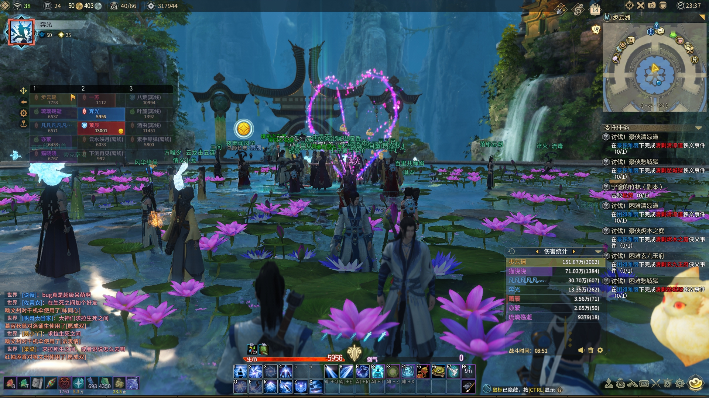
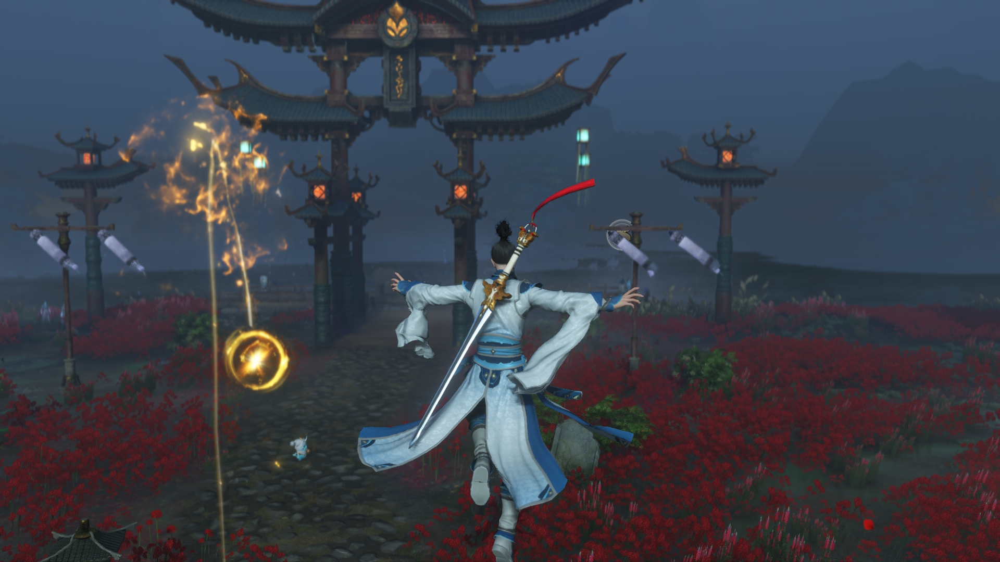
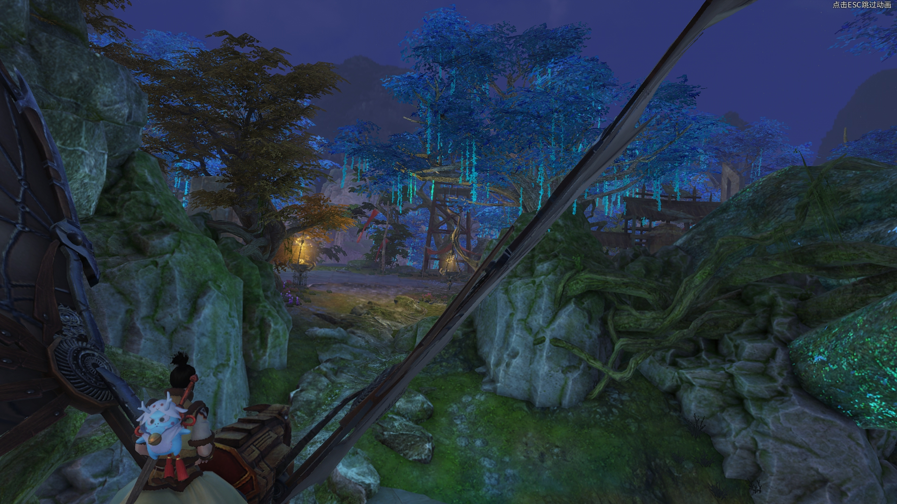
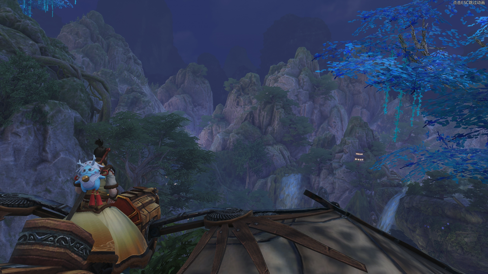

# 《古剑奇谭网络版》 四测四方面测评

## 目录
- [前言](#overview)
- [一，画质美术](#graphics)
- [二，系统设计](#design)
- [三，操作感受](#handling)
- [四，剧情表现](#story)
- [附，乱七八糟](#others)
- [感言](#acknowledgement)

------

##  前言

总评述：框架尚可，提升明显，但细节仍需打磨

------

##  一，画质美术

* **问题1-1：在弱光环境下，某些场景的画面表现比较糟糕。** （例如长阜苑，其余的夜晚地图，以及各个洞穴副本内部）具体表现在：整个场景的贴图显得非常没有质感，缺少光源，没有任何高光或其他合理的阴影反馈，整个场景显得十分扁平且没有层次感。感觉古网现在的画面表现，对天气的要求非常高，必须要阳关充足的时候画面的光影质感才比较好，如果后期古网要加上昼夜和天气表现的话，这个问题还是必须要解决的硬问题。不过古网某些弱光场景，例如生死之间，表现又出奇的好，希望其他场景可以多多学习。 
如下图的步云洲，画面光效效果非常尴尬。

而如下图的生死之间，画面表现却还是相当不错的。

* **问题1-2：岩石或山体的贴图太过模糊，远景山体建模的贴图太糊，阴影没有层次感，严重影响游玩感受。** 岩石贴图模糊体现在长阜苑，流花宫或各个副本内部，特别是江流，烬木和石火三个本。这三个本都是由各种岩石，弱光环境组成的，整个副本的画质和野外地图差距太大，对副本游玩观感造成了一定影响。具体表现在怀秀村，长合山等地图，远景的山体看着跟一个个硬纸板一样插入其中，过于妨碍视觉体验。如下面两图所示：

* **问题1-3：过场剧情的时候，例如对话的时候场景的景深效果会消失，整个画面会变得十分纸片和偏平，有碍观感。** 古网现在的画面如果没有景深的话影响还是比较大的，所以希望过场对话的时候智能景深可以加上，也方便玩家注意力集中在NPC身上。

* **问题1-4：御剑的武器设计实在是有待提高……** 建模种类不多，只有几个70品以后的武器建模是能看的。这里说的丑，不是指的建模不精细，而是说的设计和配色诡异，杂乱不严谨。举个例子，那个负青天剑的模型感觉是最常用的一个武器模型，然后无论是建模还是配色都奇丑无比，还没有新手木柄剑好看，真是没有让人换武器的动力啊……古一古二那么多单手剑的建模和设计，古网可否参考一下呢？

------

##  二，系统设计

### 问题2-1：体验乐趣和成长乐趣被割裂开来

* **问题叙述：过多的时间耗费在了枯燥的成长事件中，玩家无法将精力放在体验游戏乐趣上。** 这也是这一测我最不喜欢的地方，就像是去外面吃饭，我是去吃主菜的，结果饭店说不行，你必须要先把开头的凉菜小盘给吃了。我说好好好，那我吃凉菜，结果老板给我上了20盘凉菜。结果我20盘凉菜吃的撑撑的，说老板总得给我来主菜了吧？老板说好咧，然后……就给我上了一盘主菜，对的，就一盘。我TM是来吃主菜的你一天到晚逼我去吃开头的凉菜，主菜也没啥分量。 
在游戏中，我们无法将大部分精力投入到开荒，团本等游戏体验乐趣中，因为除了最高级的困难团本，其他无论是副本还是团本的产出均很难和声望装备相抗衡，何况团本和豪侠副本还有CD。相反地，我们的大部分时间都浪费在无意义的到处跑路赚声望，到处刷小怪赚星蕴和狗粮等无趣又浪费时间的活动上，因为这些枯燥的任务才能给我们带来最实惠的收益。这就造成了我们必须要去吃，去大量地做无趣的事才能给我们自己带来收益，反而去体验游戏乐趣变得没有价值了。体验乐趣和成长乐趣被割裂开来，让人十分烦躁。
* **建议：提升副本团本等的可玩性和收益，弱化日常声望的收益和复杂度。** 具体来说，就是提高副本和团本产出装备和材料的重要性（例如更好的装备），让玩家在费劲心力通关副本之后能得到应有的收益。同时，弱化日常任务声望的重要性，可表现在日常声望仅仅产出最低级的装备，仅仅提供一些强化石，或者很难产出高级装备等。
我觉得游戏中一个比较合理的PVE平衡应该是：以副本和团本为主要体验乐趣和主要成长项，日常只是辅助。做了日常，可以帮助你对现有装备进行更好地强化；但如果你只去打本，不做日常或者日常做的少了，影响也不大，装备也能提升。如果有些玩家不喜欢下本只靠做日常出装备，ok，没问题，也给他们这个选项，但是这么做的话要保证制造高级装备难度加大，要使得日常产出高级装备的难度远高于副本和团本（因为副本和团本的挑战难度远高于日常，当然收益也应大于日常）。
现在古网的情况本末倒置，变成了日常才是主要成长项，副本可做可不做，打通了也没有太大装备上的收益，实在让人提不起兴趣。

### 问题2-2：日常任务类型太杂且重复

* **问题叙述：古网现在的日常任务，涉及面太广太杂。** 举个例子，我们一天的日常要做多少：首先，挖宝；其次，两个日常本；再来，满世界的采集；最后，满世界的区域任务赚取声望。特别是最后两个任务，我们基本上要跑遍所有的地图。
* **建议：让每天的日常专一点，最好集中在一两个地图就好，任务种类也专一点，例如周一专门是挖宝，周二专门是钓鱼之类的。** 任务多少无所谓，只要不让人们每天重复做同样的事，不要让人们容易感到厌倦。说穿了，就是不要让玩家每天都全世界地跑，古网地图本就不大，这样还每天强制人们跑图，无聊不说，还容易让人们丧失对于地图的新鲜感。

### 问题2-3：副本中的小怪太多太杂

* **问题叙述：副本中的小怪太多太杂，严重影响副本体验和时间。** 感觉小怪数量，在精不在多，古网这一测野外小怪单体实力增强了，数量减少。但是在副本里，仍是小怪扎堆，这样一来是清一些无意义的小怪清的很累，耗费时间又无聊。
* **建议：建议仿照野外地图进行精简，留下一些有特色的精英的小怪即可。** 不如多一些有特色的精英怪，玩耍起来还比较有目标，比较有序。要不然杂鱼太多打起来乱七八糟，太过无序和混乱，又浪费时间。

### 问题2-4：照影系统数值的影响性过大

* **问题叙述：照影系统数值的影响性过大。** 整个游戏的系统实在太过冗余了，装备也多，装备的玩法也多，星蕴需求也大，就连看起来萌萌的照影系统也是需要大量的时间投入，并对于人物成长的影响也是巨大的。玩家面对这么多的系统，什么都想做，什么都不能缺，只能让人越来越累。
* **建议：建议改成娱乐向，生活技能向的产物。** 我还是建议大家削弱甚至去掉照影对于人物数值成长的影响，而转而变成一个更为生活技能项的产物。举个例子，照影不再分为四个成长方向，只有一个综合的等级，其加成的属性随着我们的专精而决定（例如DPS专精下就是攻，防御专精下就是御等），这样一来减少照影对于人物属性的影响；以及照影的技能可以偏向生活技能类，例如增加钓鱼速度，增加采集效率，增加强化石和装备掉率，增加药品持续时间等等等等。 
这里的意思，还是希望可以把照影改成一个比较软的辅助类，娱乐类系统。毕竟古网现在有的，和成长相关的硬核心系统已经够多了（装备，残卷，星蕴），就不要让玩家那么累，再去肝照影了。

### 问题2-5：装备数目过多

* **问题叙述：装备数目过多** ，达到了15件，加上武器甚至达到了16件之多，对收集造成了很大的困难。
* **建议：可以精简一下，把3件信物给取消了，留下12件就好。** 如果不想精简的话，起码让不同星蕴定式下有一些装备能共用。举个例子，每个职业的两个专精，3个信物都是共用的，加成的只是一些例如专精掌握之类的对于每个专精都有用的属性。这样做的目的是，减少玩家切换定式时的消耗，方便玩家尝试不同定式。要不然按照现在这个样子，玩家切换一个定式就意味着要换16件装备，一般的玩家实在是肝不起肝不起，一般人只能养得起一个专精，双专精也名存实亡。

### 问题2-6：副本组队

* **问题叙述：路人喊组队太累了** ，打一个日常本有时候组队都要组半天，还要在世界频道上不停地喊话和找人，实在太过心累。
* **建议：希望能有一个副本匹配系统。** 例如每日的日常任务，可以直接通过系统匹配后直接进本之类的，免去跑路和地图上喊话的时间。

------

##  三，操作感受

------

##  四，剧情表现

古网虽然在剧情上投入的精力和心血很多，但是这个剧情文案本身的问题，以及编排上需要调整的地方也很多，感觉还是需要好好调优的。

### 问题4-1：门派的存在感太低

* **问题叙述：古网历测体现出来的，和门派相关的内容均是比较尴尬。** 首先，所有的职业开头剧情都是一样的，只是用文字的方式介绍了一下过往；其次，太华山百草谷补天岭三个地图只是三个较小的任务地图，没有任何门派元素；最后，用来弥补门派归属感的门派洞天也没有很好地营造起气氛，仅仅是一个观光地而已，玩家和门派洞天互动不足。总而言之，我们对于自己的职业身份并没有很强的共情。 
* **建议：这个问题比较大，烛龙肯定也有自己的考虑，我就提一个小建议，就是既然三个门派的完整地图工程量太大，做不出来，干脆就把各个门派洞天再扩大一点，设定改一下，用来承载新手任务吧。** 拿御剑举例，可以将御剑的沉壁渊扩大一些，放入更多的建筑和NPC，然后将开头的文字叙述做成任务放入沉壁渊中——用几个任务讲述我是如何拿到自己的佩剑，教授一下新手技能，以及是如何通过选拔来到鼎剑锋参加剑心试炼的。其他职业亦是同理。（当然，如果这么做的话，会涉及到一些设定上的逻辑bug，这就需要对设定进行一点微调了）

### 问题4-2：整个剧情缺乏motivation

* **问题叙述：整个剧情的motivation（动机）比较奇怪，我们莫名其妙地就参与了主线的发展。** 我就是一个刚入门的弟子，怎么就钦定去拯救世界了呢？我也实在不是谦虚，和昊苍说：你们还是另请高明把。昊苍说道：秦陵之盟已经研究决定啦，就由你来当玉面蛟龙！……说正经的，感觉整个剧情的开头比较奇怪，我只是一个小小的弟子，遇到了这么大的事情，为啥你们碰到啥事都要叫我同行帮忙呢？话说就我这菜鸟你们不觉得我去或不去根本就没影响吗？我们所操作的角色全程都在被推着走，感觉自己是可有可无的，一直没有一个强烈的motivation。 
整个剧情从头到尾，都没人问过主角，他想不想继续搜查下去。我就是个无关的路人，突然就被拉来帮你们忙了……这件事还挺危险的，动不动就邪气入体要丧命，我就想好好呆在门派洞天打酱油不行么…… 
* **建议：希望开头处可以有一些矛盾和冲突，让玩家不仅仅是被NPC推着走，起码在剧情设定上也是自己想继续追查下去的。** 例如百草谷昊苍叛变后，昊苍将守卫百草谷的主角的一个同门师姐重伤（这个师姐可以在开头的门派新手任务中出现，和主角一起经过入门试炼，增加和主角的羁绊）。然后主角在门派长老们面前立誓一定要追回昊苍，为师姐报仇雪恨之类的。
当然，这里只是一个比较随意的脑洞。这个脑洞后面体现出来的思想是，希望我们的主角也能有自己的motivation，来参与主线的发展，要不然我玩着玩着经常缺乏动力，觉得这些东西你们为啥叫我干？自己想去做，和被别人推着去做，是两件不一样的事。

### 问题4-3：主线缺乏明确脉络

* **问题叙述：整个剧情的主线没有一条明确的脉络，倒是多个独立的情景剧的串联。** 我们整个主线到底是去追查什么东西的，最根本的goal（目标）是什么？你让我现在想想，我还真的有点想不起来了。感觉有时候又是邪剑，有时候又是陌胜剑，有时候又是仪商剑；有时候又是魅珈，有时候又是昊苍，有时候又是荒人，有时候又是惊蛰教，有时候又突然跑去救小白龙，有时候莫名其妙地我又差点挂了。每到一个新的地方，就感觉我开始的是一段新的故事，和之前得故事完全独立了，连不起来。讲道理，连我这种从单机玩过来的玩家都有点迷糊了，一般的网游玩家更是一脸懵逼吧。
* **建议：更改主线任务的表述方式，首先是将现有的主线任务进行拆分，拆分成总目标主线和小目标主线。** 具体来说，就是说主线任务不要只显示一个任务，而是可以采取一个大目标+多个小目标的形式。我举个例子，当古网现在进入江都之后，我们的大目标主线变变成了一个笼统的目标：在江都内探寻惊蛰教线索（除此之外并没有任何提示）。然后江都城内亮起了多个主线剧情点。玩家可以自由选择先做哪个，后做哪个，只有这几个小目标主线都做完了之后，我们的大目标主线才会更新到：前往上淮清野追寻xxx线索。
这样的拆分方式，意思是随时随地地提醒玩家，我们现在的总目标是什么，我们的一个稍微长期的目标是什么，我们现在做的这些琐碎的事为为了什么，我们的goal是什么？要不然按照古网现在线性，破碎又流水账的任务一直做下去又没有提醒的话，我都忘了我到底是来干嘛的了。

### 问题4-4：任务搭配缺少代入感

* **问题叙述：整个古网的主线支线任务搭配混乱，整体不严谨，缺少代入感。** 举个例子，在拔仙台剧情处，玩家都要挂了，NPC还乐呵地差使玩家去干杂活……类似的情节屡见不鲜，感觉古网在任务，特别是支线任务上特别不走心，就感觉是为了任务而设定的任务，完全没有和当时的主线情境相挂钩，一旦带入去看就会显得特别搞笑。每当我想去代入到角色中的时候，游戏就会狠狠地敲击我：别太认真了，我们就是在过家家呢。
* **建议：其次是调整支线和主线的次序，支线任务应该要配合和满足主线任务，不能破坏主线任务的代入感。** 还是那拔仙台处的剧情举例，玩家都快挂了，去拔仙台的第一件事当然是先去救命啊！！！为什么还有闲情去打杂啊！！！角色自己就不怕自己没命么！！！所以合理的剧情编排应该是： 
首先，玩家在邪剑入体后会有一个debuff，血量上限减少，攻击降低，CD变长等（让玩家感受到自己确实情况不妙了）；然后，进入拔仙台后只有救自己的命这个主线任务（并且这个主线任务环最多只有几个），其他的支线任务完全不显示；接下来，我们被迅速传送到拔仙台顶部，喝上救命药；最后，复原了之后，再让主角去拔仙台的温泉泡澡，这才开放拔仙台的其他主线和支线任务。（等于让玩家在紧张的救命环节之后舒缓下来，才有闲情逸致去打杂）。 
这样的安排，才是一张一弛，符合逻辑。

### 问题4-5：NPC的位置bug

* **问题叙述：随着剧情和任务的推进，要记得删除到原剧情位置处的NPC建模。** 在后期我们回到拔仙台的温泉处，还能看到公主和白蛟在泡温泉，还能看到钟无痴在那当品石高人，明显不合逻辑。
* **建议：这应该算个bug？** 尽早修复吧。

------

##  附，乱七八糟

------

##  感言
